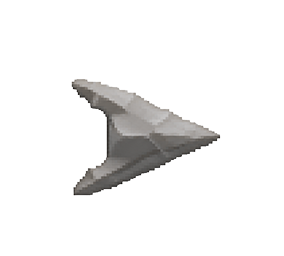
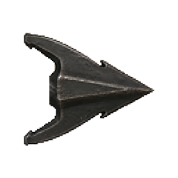
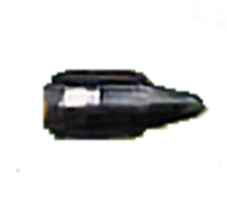
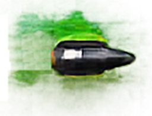
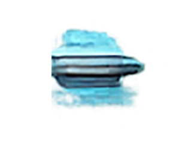
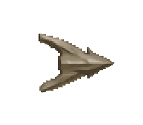
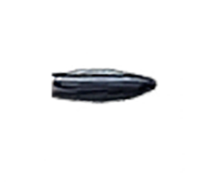

# Fletchers Forge

Disassemble vanilla arrows into **shafts** and **arrowheads**, craft components at vanilla stations, and **reforge ammunition in the field** with the **Fletcher's knife**.

**Current version:** 0.1.32  
**Requires:** BepInEx + Jötunn

**Links**
- **[Team Extreme Discord](https://discord.gg/cCNG8xKXMn)** — setup help, bug reports, and updates
- **[GitHub — Fletchers Forge](https://github.com/cdjensen99-sudo/FketchersForge)** — source code and issues

---

## What this mod does

| You can… | Where |
|----------|--------|
| Craft arrow **shafts** and **heads** (stacks of 20) | Workbench / Forge / Black forge |
| **Split** arrows into shaft + head | Field — Fletcher's bench |
| **Reforge** shaft + head into arrows | Field — Fletcher's bench |
| **Rehead** arrows (swap head type) | Field — Fletcher's bench |
| Carry finished ammo as normal **vanilla arrows** | Inventory / bow |

There is **no material salvage** beyond shafts and heads (no wood/ore back from splitting).

---

## Quick start

1. Install **BepInEx** and **Jötunn** (see Dependencies).
2. Install **Fletchers Forge** into `BepInEx/plugins/Hardwire99-FletchersForge/`.
3. Craft a **Fletcher's knife** at the **Forge** (level 1).
4. Hold the knife in your **hand** — the **Fletcher's bench** opens automatically.
5. Use **Reforge** or **Split** (buttons or keys below). Results go **directly into your inventory** — there is no take-all step.

---

## Fletcher's knife

| | |
|--|--|
| **Recipe** | Forge level 1 — Fine wood ×1, Copper ×1, Leather scraps ×1 |
| **Role** | Opens the field bench; used for reforge / split only |
| **Combat** | No damage; does not wear out from normal use |
| **Bench** | Auto-opens when the knife is **in your hand**; stays open while equipped |

---

## Arrow components

### Shafts (inventory stack **100**)

| Item | Craft station | Notes |
|------|---------------|--------|
| Arrow shaft | Workbench 1 | Wood ×8, Feathers ×2 → **20** shafts |
| Needle arrow shaft | Workbench 4 | Feathers ×2 → **20** shafts |
| Ashwood arrow shaft | Workbench 3 | Black wood ×8, Feathers ×2 → **20** shafts |

**World drop:** small arrow-shaft mesh (not the cargo crate).

### Arrowheads (inventory stack **200**)

Craft output is always **20** per recipe batch.

| Head | Station | Materials |
|------|---------|-----------|
| Fire | Workbench 2 | Resin ×8 |
| Flint | Workbench 2 | Flint ×2 |
| Bronze | Forge 1 | Bronze ×1 |
| Iron | Forge 2 | Iron ×1 |
| Silver | Forge 3 | Silver ×1 |
| Obsidian | Workbench 3 | Obsidian ×4 |
| Poison | Workbench 3 | Obsidian ×4, Ooze ×2 |
| Frost | Workbench 4 | Obsidian ×4, Freeze gland ×1 |
| Needle | Workbench 4 | Needle ×4 |
| Carapace | Black forge 1 | Carapace ×4 |
| Charred | Black forge 3 | Charred bone ×4 |

**World drop:** small **cargo crate** mesh (25% scale) — a square ship crate, not a chest with a lid.

### Arrowhead inventory icons (embedded PNG)

Arrowhead icons ship **inside `FletchersForge.dll`** — players do **not** need an `Icons` folder in their profile.

Optional overrides: set `AllowExternalHeadIconOverrides = true` in config, then place PNGs in:

`BepInEx/plugins/Hardwire99-FletchersForge/Icons/`

| File name | Arrow type |
|-----------|------------|
| `FF_HeadFire.png` | Fire |
| `FF_HeadFlint.png` | Flint |
| `FF_HeadBronze.png` | Bronze |
| `FF_HeadIron.png` | Iron |
| `FF_HeadSilver.png` | Silver |
| `FF_HeadObsidian.png` | Obsidian |
| `FF_HeadPoison.png` | Poison |
| `FF_HeadFrost.png` | Frost |
| `FF_HeadNeedle.png` | Needle |
| `FF_HeadCarapace.png` | Carapace |
| `FF_HeadCharred.png` | Charred |

Recommended: **128×128 PNG**, transparent background. Restart after adding external overrides.

#### Icon gallery (bundled examples)

| | | |
|:---:|:---:|:---:|
|  |  |  |
| Fire | Flint | Bronze |
|  |  |  |
| Iron | Silver | Obsidian |
|  |  |  |
| Poison | Frost | Needle |
|  |  | |
| Carapace | Charred | |

---

## Field bench (Fletcher's bench)

Opens automatically when the **Fletcher's knife** is in your hand (same as holding it ready to use).

### Slots

| Slot | Accepts |
|------|---------|
| **Left** | Arrow **shaft** or full **arrow** |
| **Right** | **Arrowhead** only |

### Actions

Results are added to your **inventory** immediately. You do **not** use Take all / Place stacks — those vanilla container actions are **not** part of this workflow.

| Action | Button label | Default key | Effect |
|--------|--------------|-------------|--------|
| **Reforge** | Reforge | *(none — use button)* | Shaft + head → **20** arrows; or arrow + new head → rehead |
| **Split** | Split | *(none — use button)* | **20** arrows → shaft + head (wood arrows → shaft only) |

The wood panel shows **Reforge** and **Split** in the usual container button row (repurposed from vanilla UI chrome).

---

## Vanilla arrow mapping

| Vanilla arrow | Shaft | Head |
|---------------|-------|------|
| Wood | Standard | *(none — split gives shaft only)* |
| Fire | Standard | Fire |
| Flint | Standard | Flint |
| Bronze | Standard | Bronze |
| Iron | Standard | Iron |
| Silver | Standard | Silver |
| Obsidian | Standard | Obsidian |
| Poison | Standard | Poison |
| Frost | Standard | Frost |
| Needle | Needle | Needle |
| Carapace | Standard | Carapace |
| Charred | Ashwood | Charred |

---

## Configuration

File: `BepInEx/config/hardwire99.fletchersforge.cfg`

| Section | Key | Default | Description |
|---------|-----|---------|-------------|
| **General** | `Enabled` | `true` | Turn the entire mod off without uninstalling. |
| **Icons** | `UseEmbeddedHeadIcons` | `true` | Load arrowhead icons bundled in the DLL. |
| **Icons** | `AllowExternalHeadIconOverrides` | `false` | When `true`, PNGs in the plugin `Icons` folder override embedded art. |
| **Controls** | `Reforge` | `None` | Reforge hotkey while the bench is open (`None` = button only). |
| **Controls** | `Split` | `None` | Split hotkey while the bench is open (`None` = button only). |

There is **no key to open the bench** — it opens when the knife is **in your hand**.

After editing the config, restart Valheim (or reload the profile).

---

## Bjornheim / legacy save cleanup

Early builds (0.1.1–0.1.8) spawned **phantom bench objects** in the world save. That can cause **ChestSnap** errors and hundreds of unknown ZDOs (hash `555343901`).

**0.1.30** runs cleanup after ZDOs load (`ZDOMan.Load`), on player spawn, and via `fletcher.cleanup`. It also sanitizes null ChestSnap network views so phantom benches from early builds no longer spam errors.

### Manual cleanup (recommended once on affected saves)

1. Load the world (as host / single-player).
2. Open the console (**F5**).
3. Run: `fletcher.cleanup`
4. Run: `save`
5. Restart the game and confirm ChestSnap no longer spams errors.

---

## Multiplayer notes

- Field bench uses a **local inventory** (not a world container) — each player reforges their own items.
- Knife equip / bench UI runs only for the **local player** (`IsOwner()`).
- Legacy ZDO cleanup runs on the **server** when purging save data; clients still sanitize null network views for ChestSnap.
- **Not yet playtested** on dedicated servers; code paths are local-player scoped and should be safe, but verify with your group.

---

## Folder layout (plugin)

```
Hardwire99-FletchersForge/
  FletchersForge.dll    (includes embedded arrowhead PNG icons)
  manifest.json
  Icons/                (optional — only if AllowExternalHeadIconOverrides = true)
```

---

## Known / upcoming

- [ ] Quiver and Unity Store weapon assets
- [ ] Dedicated multiplayer playtest

---

## Credits

- **Author:** Hardwire99  
- **Framework:** Jötunn / Valheim modding community
